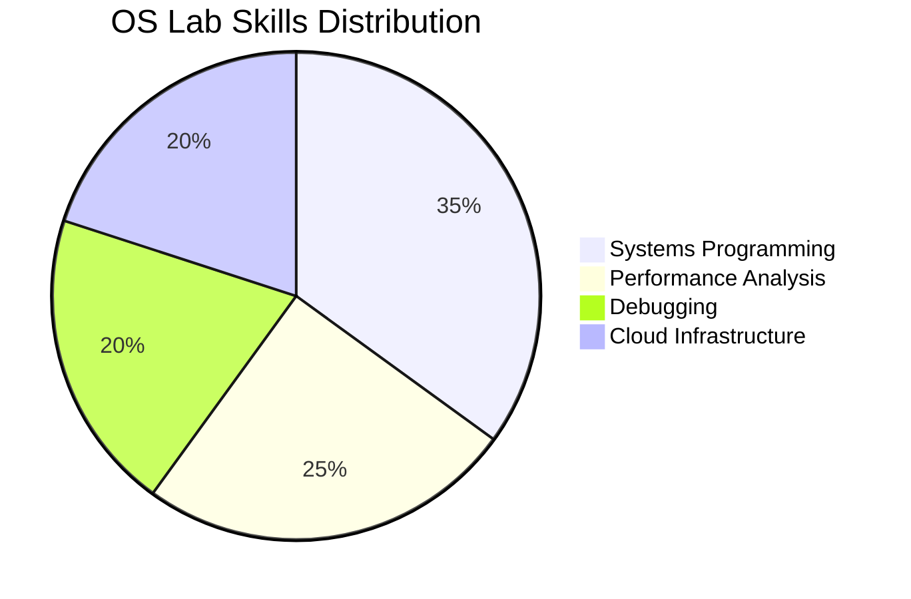

# 💻 CSE 406 - Operating Systems Lab

[](https://uapians.github.io/CSE-406-Operating-Systems-Lab/) 
[](https://classroom.github.com/classrooms/...)

**Hands-On Systems Programming with Modern Tooling**

```ascii
         [Bare-Metal Coding] --> [Kernel Hacking] --> [Cloud-Scale Debugging]
                  \                   |                   /
                   \                  |                  /
                    V          [Visual Debugging]       V
```

## 🧪 Lab Roadmap
| Week | Focus Area | Industry Tool | Visual Output |
|------|------------|---------------|---------------|
| 1-4  | Process Management | `strace`, `perf` | Process Tree Animations |
| 5-8  | Memory Systems | `Valgrind`, `eBPF` | Memory Heatmaps |
| 9-12 | File Systems | `FUSE`, `ext4debug` | FS Structure Visualizers |

## 🔥 Featured Labs
1. **Linux Scheduler Modding**  
   - Alter CFS parameters
   - Visualize CPU share distribution
   - [Sample Solution](https://github.com/UAPians/CSE-406-OS-Lab/tree/main/Hands-On-Projects/Process-Scheduler-Mod)

2. **Kernel Module Development**  
   - Create character device driver
   - Interactive debugging with `kgdb`
   - [Starter Code](https://github.com/UAPians/CSE-406-OS-Lab/tree/main/Lab-Environments/Kernel-Debugging)

3. **Container Internals**  
   - Build container runtime from scratch
   - Namespace/cgroup visualization
   - [Tutorial](https://github.com/UAPians/CSE-406-OS-Lab/tree/main/Industry-Tools/Cloud-Native-OS)

## 🛠️ Lab Environment Setup
```bash
# Preconfigured Dev Container
git clone https://github.com/UAPians/CSE-406-OS-Lab
cd CSE-406-OS-Lab
docker-compose up -d lab-env

# Includes:
# - QEMU ARM/x86 VMs
# - Kernel Debugging Tools
# - Performance Monitoring Suite
```

## 📊 Lab Submission Guide
1. Create branch: `lab<number>-<your-id>`
2. Include:
   - Code with documentation
   - Visual explainer (SVG/HTML)
   - Performance metrics
3. Submit PR with [Lab Report Template](https://github.com/UAPians/CSE-406-OS-Lab/blob/main/.github/ISSUE_TEMPLATE/lab-report.md)

## 🚀 Career Pathways


---
